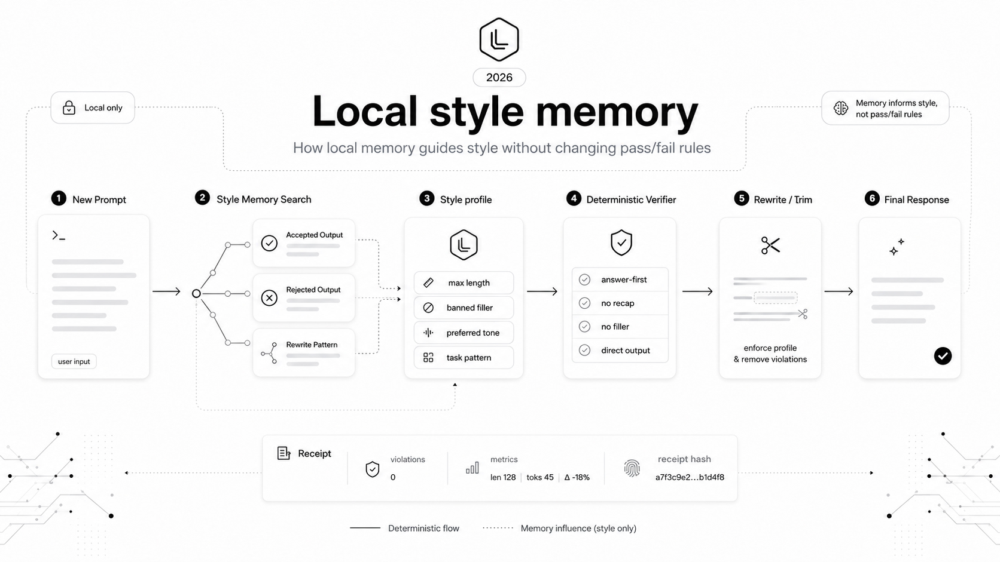

# laconic-skill

AI agents write too much.

laconic-skill checks AI output before humans have to read it. It can pass, fail, rewrite, and emit receipts for concise-output checks without calling a model during verification.

The model drafts. The runtime verifies.

laconic-skill is a deterministic verifier for concise AI output. It runs as a local CLI, emits receipts, and validates as a Claude Code plugin.

Use it for:

- AI-generated pull request descriptions
- code review comments
- agent status updates
- documentation drafts
- any workflow where verbose AI output wastes reviewer time

## Why this exists

Prompting can ask an AI to be brief. It cannot prove the output stayed brief.

laconic-skill runs outside the model. It applies deterministic rules, returns pass/fail results, and can emit a JSON receipt for the check.

## Try it in 60 seconds

Install and build once:

```bash
npm install
npm run build
```

Check a concise output:

```bash
node dist/cli.js check fixtures/pass/compliant.txt --receipt
```

Rewrite a verbose output:

```bash
node dist/cli.js rewrite fixtures/fail/verbose_recap_heavy.txt --receipt
```

Run the full pipeline:

```bash
node dist/cli.js pipeline fixtures/fail/filler_heavy.txt --task writing --receipt
```

Emit a receipt from stdin:

```bash
cat output.txt | node dist/cli.js check - --receipt
```

## Verified proof

- `50` corpus files: the benchmark runs against realistic verbose AI outputs in `benchmarks/corpus/*.txt`.
- `48.028%` average character reduction: the benchmark reports measured shrinkage after deterministic rewrite without unsafe over-trimming.
- `50/50` fixable outputs passed after rewrite: every benchmark output that started failing passed after rewrite.
- `0` compliant false fails: short compliant controls in `benchmarks/compliant/*.txt` stayed passing.
- `200` public assistant-prose eval cases: `npm run eval:labeled` checks frozen labels in `eval/prose/labels.json`.
- `0` labeled prose misses: the public prose eval currently reports `16` expected pass, `184` expected fail, and `56/56` fixable rewrites passed.
- Deterministic across `5` runs: the benchmark repeats and compares stable output signatures.
- Structural detection: the verifier detects formulaic AI patterns and reports `structuralPatternCount`.
- Quality scoring: verifier metrics include `qualityScore`, so output is scored instead of only stamped pass/fail.
- Preservation checks: rewrite receipts include substantive-token preservation metrics.
- No model calls during verification: the verifier runs locally and deterministically; `package.json` includes no model SDK dependency.
- Receipt hash determinism: tests verify the same input/output/config produces the same receipt hash.
- Claude Code plugin validation: the plugin manifest passed `claude plugin validate .`.

Evaluation gates:

- `npm run benchmark` checks curated benchmark and holdout rewrite behavior.
- `npm run benchmark:compare` runs the same blind corpus through laconic checks and a deterministic Stop Slop-style pattern scanner.
- `npm run eval:scrapegraphai` checks 100 local ScrapeGraphAI structured-output rows when `rows.json` is present.
- `npm run eval:labeled` checks the checked-in 200-case public assistant-prose eval.
- See `docs/evaluation.md` for what each gate does and does not prove.

## What it does

A local verification runtime for concise AI output.

- checks output
- rewrites verbose output
- runs pipelines
- emits receipts
- optionally uses local style memory
- integrates with Claude Code

## Optional correctness confidence

laconic-skill verifies response shape by default. For task-specific correctness, it can calculate statistical confidence when you provide measured evaluation results and specification limits.

## Architecture

```text
input
-> draft text
-> laconic verifier
-> optional deterministic rewrite
-> final text
-> receipt
```

Core pieces:

- `skills/laconic-responses/SKILL.md` defines the laconic response behavior.
- `src/verifier.ts` checks length, bullets, filler, preambles, repeated prompts, answer-first opening, caveat limits, and structural AI patterns.
- `src/rewrite.ts` trims output without inventing facts; receipts include preservation metrics for rewritten output.
- `src/receipt.ts` creates hash-bound receipts.
- `src/pipeline.ts` connects draft text, verification, optional rewrite, placeholder correctness checks, and receipts.
- `src/memory/` contains optional local style memory.

## Local memory boundary



Memory can guide style.
Memory does not decide verifier pass/fail.

Memory can affect style retrieval, preferred phrasing, and rewrite suggestions. It does not override deterministic checks or rule enforcement.

Memory-enabled pipeline receipts may include memory metrics so the receipt identifies the exact run context. Core verifier receipts do not require memory.

## Examples

- Full walkthroughs: `EXAMPLES.md`
- Basic check: `examples/basic-check.md`
- Rewrite before/after: `examples/rewrite-before-after.md`
- Pipeline receipt: `examples/pipeline-receipt.json`

## Claude Code plugin

Local test:

```bash
claude --plugin-dir .
```

Invoke the skill:

```text
/laconic-skill:laconic-responses
```

Validate the plugin:

```bash
claude plugin validate .
```

## CLI usage

Check output:

```bash
node dist/cli.js check fixtures/pass/compliant.txt --receipt
```

Rewrite verbose output:

```bash
node dist/cli.js rewrite fixtures/fail/verbose_recap_heavy.txt --receipt
```

Run the pipeline:

```bash
node dist/cli.js pipeline fixtures/fail/filler_heavy.txt --task writing --receipt
```

Use local style memory:

```bash
node dist/cli.js memory add fixtures/pass/compliant.txt --outcome accepted --task writing
node dist/cli.js memory search "npm run build" --limit 5
node dist/cli.js pipeline fixtures/fail/filler_heavy.txt --task writing --memory --receipt
```

## License

laconic-skill is open source under the Apache License 2.0.

Attribution is preserved through the project NOTICE file:

Electric Wolfe Marshmallow Hypertext | Tionne Smith, 2026.

The software is Apache-2.0 licensed. Project names, marks, and branding are reserved separately.

Inspired by Karpathy's public skill-file. Not affiliated with Andrej Karpathy.
